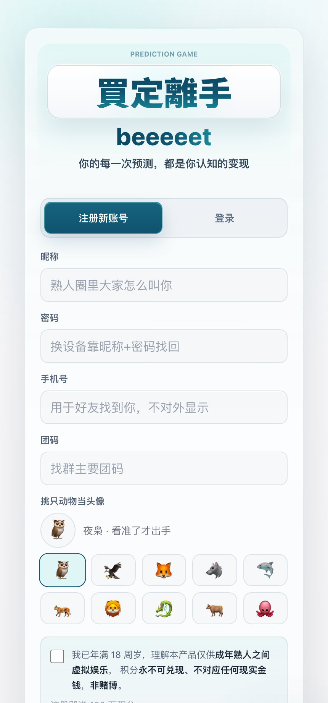
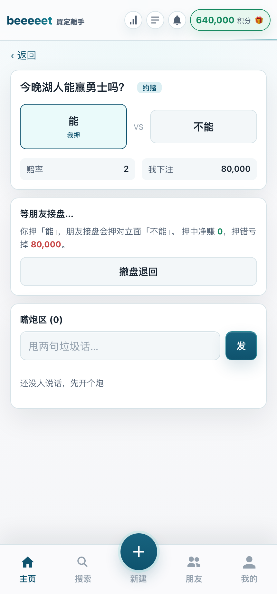
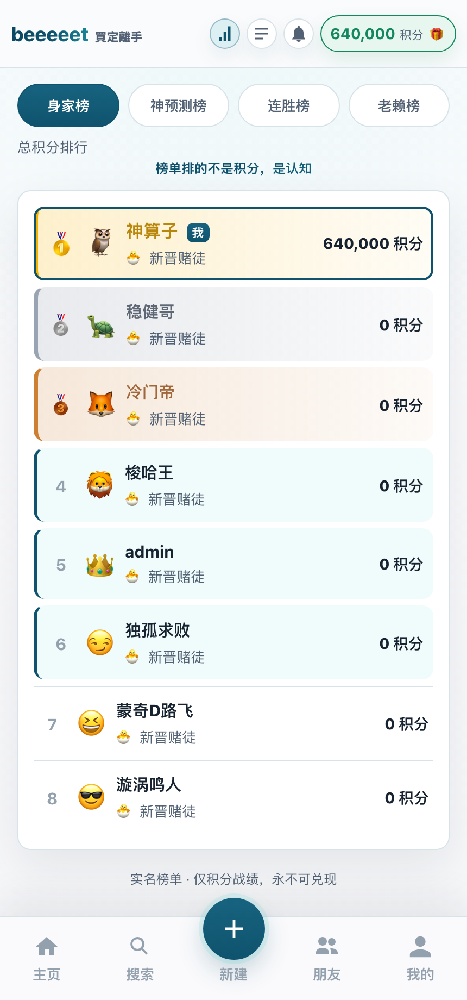

<div align="center">

# 買定離手 · beeeeet

### 口说无凭，下注为证。

**📦 你正在看「单机版」分支**（纯前端 · localStorage 本地对战 · 无需后端）｜联机版见 `main` 分支

**一个给熟人小圈玩的预测对赌游戏——比的是眼光和认知，不是运气。**
朋友之间对各种「会发生 / 不会发生」的事开盘对赌，纯虚拟积分、永不兑现真钱，
图的就是饭桌上、群里那口「我看得比你准」的不服气。

<br>






<sub>登录 · 开盘对赌 · 下注与嘴炮 · 认知榜单</sub>

  

</div>

---

## ✨ 这是什么

每个熟人群里都有那种争论：「这球主队肯定赢」「老王这周末绝对脱单」「这币还得涨」……
**買定離手把这些口水仗变成一场场可量化的对赌**：你开个盘、定个赔率，朋友来接，到点揭晓，赢家通吃积分、上榜单、被群嘲或被膜拜。

- 🎯 **比眼光，不比运气**——下注的是你对真实世界的判断力。
- 💸 **纯虚拟积分，永不兑现**——零金钱风险，赢的是面子和认知优越感。
- 👥 **熟人小圈专属**——团码进群，30 人的饭桌江湖。

## 🎯 它的价值

| | |
|---|---|
| **对朋友圈** | 把无意义的吹牛和争论，沉淀成「谁的判断力更强」的长期战绩。赢一次嘴，不如赢一局盘。 |
| **对你自己** | 用虚拟积分逼真地训练判断与下注纪律——什么时候该 all-in，什么时候该认怂，眼光是可以练出来的。 |
| **作为工程** | 一套完整、自洽的全栈实现：实时对赌、权威结算、**资金守恒不变式**、**幂等防重复扣款**——可作为「预测市场 / 社交对赌」类产品的参考实现。 |

## 🎮 玩法

**🎲 真人对赌**（三种模式）
- **约赌**：1v1 开盘，你押一边、定赔率，朋友接对立面，到点揭晓赢家通吃。
- **坐庄**：你当庄家挂赔率收注，多人来押，封顶控制风险。
- **彩池**：多人投同一事件，赢方按比例瓜分输方的池子。

**📈 系统盘**
- 接入真实事件的市场参考概率（体育 / 加密 / 国际 / 财经 / 世界杯专区…），跟着大盘用积分押注，练自己的认知水位。

**🤖 AI 开盘助手**
- 用大白话写个含糊的题，AI 帮你打磨成「怎么算赢、以什么为准、何时揭晓」的无歧义判定标准。

**🏆 社交竞技**
- 好友 / 私信 / **嘴炮评论**（赌局里甩两句垃圾话）/ 每日签到 / 赛季
- 四张榜单：**身家榜 · 神预测榜（胜率）· 连胜榜 · 老赖榜**——熟人圈里见真章
- 揭晓裁定 + 申诉机制，争议有的聊

## 🧠 设计理念

放大人「**比眼光、比认知**」的那股较劲心——把「我赢了」升华成「我比你更懂」。
所以核心从来不是赌钱（永不兑现），而是**用可量化的战绩，证明你的判断力**。榜单排的不是积分，是认知。

## 🛠 技术亮点

| 层 | 技术 |
|---|---|
| 前端 | Vue 3 + Vite，纯 `reactive` 状态管理（无 Pinia） |
| 后端 | Fastify 5 + better-sqlite3，JWT 鉴权 |
| 共享 | `src/core/` 前后端共享纯函数（赔率 / 结算 / 段位 / 治理），完整单测 |
| 形态 | **联机版**（C/S，多人实时）+ **单机版**（纯前端 localStorage 本地对战，见 `offline` 分支） |

**两条工程红线**
- 🔒 **资金守恒**：`SUM(用户 balance + frozen) == SUM(系统账本)`，每一笔动钱后精确守恒，绝不凭空造分。
- 🔁 **幂等**：所有动钱接口走 `X-Idempotency-Key`，断网重试不会重复扣款 / 派彩。

## 🚀 本地运行

```bash
# 前端
npm install
npm run dev

# 后端（联机版，需 Node ≥ 20）
cd server
npm install
npm run bootstrap   # 首次建库（管理员 + 团码）
npm start           # 听 127.0.0.1:8788
```

前端 `vite.config.js` 已把 `/api` 代理到本地后端；DeepSeek key 走 `.env.local` 注入，不进代码。

```bash
# 测试
npx vitest run         # 前端 + 共享逻辑
cd server && npm test  # 后端（含守恒回归用例）
```

## ⚠️ 免责声明

**纯虚拟积分娱乐项目，积分永不可兑现为任何真实货币或财物**，仅供熟人之间趣味对赌、锻炼判断力。请理性娱乐。

## 📄 License

[MIT](./LICENSE) © 2026 beeeeet
